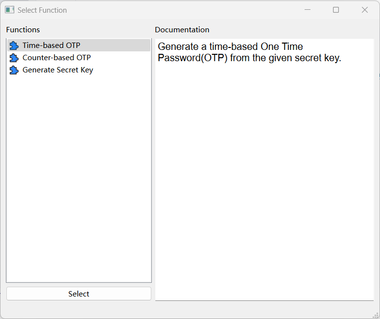
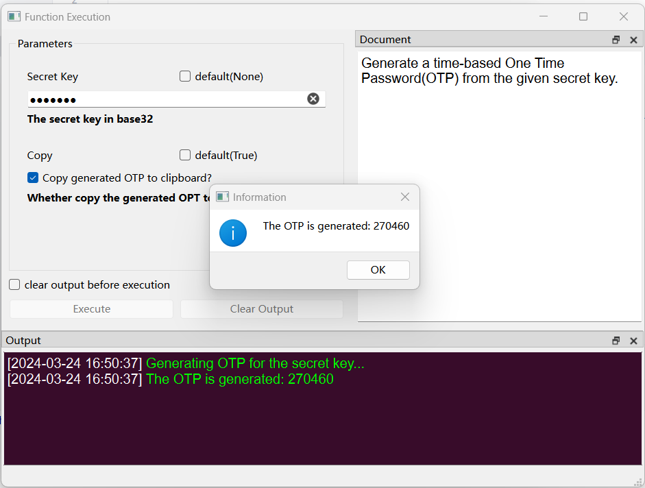
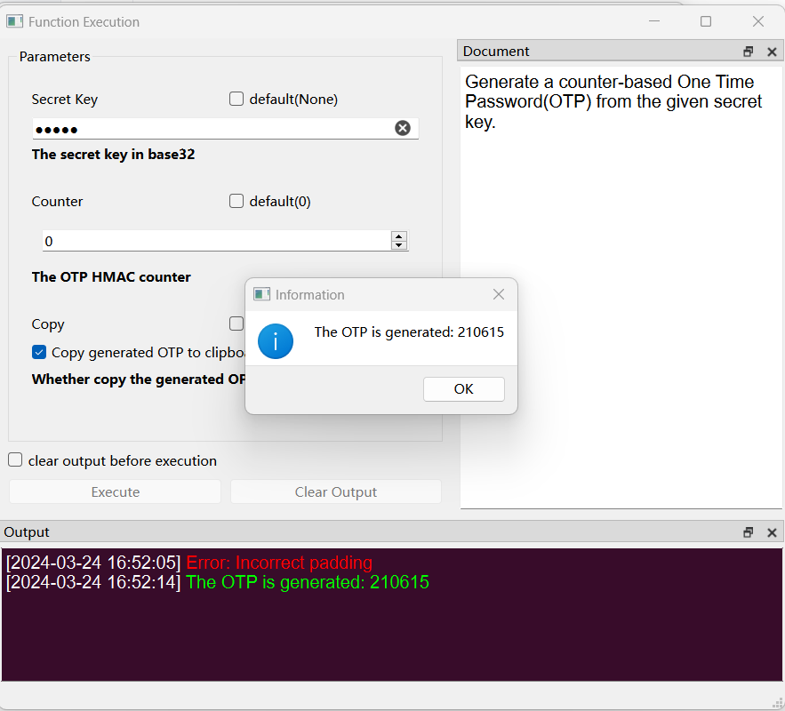
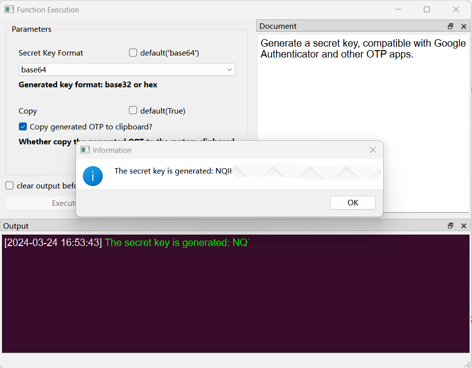

# Simple OTP

### **A simple GUI OTP generator based on pyotp and PyGUIAdapter.**

## Screenshots

## Link

### **This project is using [PyGUIAdapter](https://github.com/zimolab/PyGUIAdapter) to create GUI.**